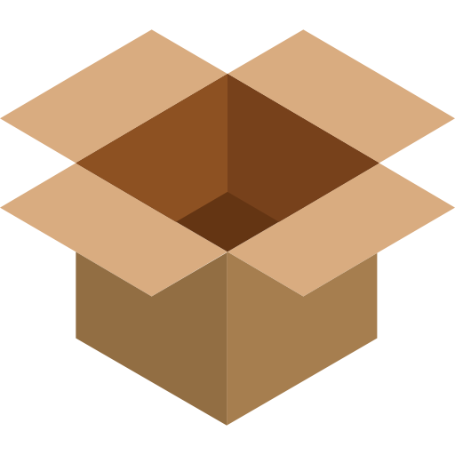

### Image Credits

#### 1. Dummy data profile images

1.1. Workspace/dummy-data-assets/images/profile-images/sample-one.png => 

  <kbd>
    
  </kbd>

Figure 1.1: Image by <a href="https://www.flaticon.com/free-icons/user" title="user icons">User icons created by Freepik - Flaticon</a>

1.2. Workspace/dummy-data-assets/images/profile-images/sample-two.png => 

  <kbd>
    
  </kbd>

Figure 1.2: Image by <a href="https://www.freepik.com/icon/google-contacts_720236#fromView=keyword&term=Google+Contacts&page=1&position=0">Icon by Freepik</a>

1.3. Workspace/dummy-data-assets/images/profile-images/sample-three.png =>

  <kbd>
    
  </kbd>

Figure 1.3: Image by <a href="https://www.flaticon.com/free-icons/user" title="user icons">User icons created by dmitri13 - Flaticon</a>

1.4. Workspace/dummy-data-assets/images/profile-images/sample-four.png =>

  <kbd>
    
  </kbd>

Figure 1.4: Image by <a href="https://www.flaticon.com/free-icons/user" title="user icons">User icons created by Freepik - Flaticon</a>

1.5. Workspace/dummy-data-assets/images/profile-images/sample-five.png =>

  <kbd>
    
  </kbd>

Figure 1.5: Image by <a href="https://www.flaticon.com/free-icons/user" title="user icons">User icons created by Smashicons - Flaticon</a>

### 2. Dummy data post images

2.1. Workspace/dummy-data-assets/images/post-images/sample-one.jpg => 

  <kbd>
    
  </kbd>

Figure 2.1: <a href="https://www.freepik.com/free-photo/vintage-japanese-mobile-phone-case-pattern-set-remix-artwork-by-watanabe-seitei_13309085.htm#query=cases&position=8&from_view=search&track=sph">Image by rawpixel.com</a> on Freepik

2.2. Workspace/dummy-data-assets/images/post-images/sample-two.jpg =>

  <kbd>
    
  </kbd>

Figure 2.2: <a href="https://www.freepik.com/free-photo/front-view-black-plastic-bottle-from-shampoo-with-pink-strip_7801999.htm#query=products&position=14&from_view=search&track=sph">Image by KamranAydinov</a> on Freepik

2.3. Workspace/dummy-data-assets/images/post-images/sample-three.jpg =>

  <kbd>
    
  </kbd>

Figure 2.3: Image by <a href="https://www.freepik.com/free-photo/toilet-bag-baggage-arrangement_33795562.htm#page=2&query=products&position=6&from_view=search&track=sph">Freepik</a>

2.4. Workspace/dummy-data-assets/images/post-images/sample-four.jpg =>

  <kbd>
    
  </kbd>

Figure 2.4: <a href="https://www.freepik.com/free-photo/mobile-phone-cases-mockup-product-showcase_12190867.htm#query=cases&position=11&from_view=search&track=sph">Image by rawpixel.com</a> on Freepik

2.5. Workspace/dummy-data-assets/images/post-images/sample-five.jpg =>

  <kbd>
    
  </kbd>

Figure 2.5: Image by <a href="https://www.freepik.com/free-photo/levitating-music-headphones-display_33140234.htm#query=products&position=0&from_view=search&track=sph">Freepik</a>

### 3. Client-side NextJS app images

3.1. Workspace/noon-social_media_website/client/src/assets/images/dislike.png =>

  <kbd>
    
  </kbd>

Figure 3.1: Image by <a href="https://www.flaticon.com/free-icons/dislike" title="dislike icons">Dislike icons created by Vectors Market - Flaticon</a>

3.2. Workspace/noon-social_media_website/client/src/assets/images/empty-box.png =>

  <kbd>
    
  </kbd>

Figure 3.2: Image by <a href="https://www.flaticon.com/free-icons/box" title="box icons">Box icons created by Good Ware - Flaticon</a>

3.3. Workspace/noon-social_media_website/client/src/assets/images/favicon-logo.png =>

  <kbd>
    
  </kbd>

Figure 3.3: Image by <a href="https://www.flaticon.com/free-icons/share" title="share icons">Share icons created by srip - Flaticon</a>

3.4. Workspace/noon-social_media_website/client/src/assets/images/like-checked.png =>

  <kbd>
    
  </kbd>

Figure 3.4: Image by <a href="https://www.flaticon.com/free-icons/like" title="like icons">Like icons created by Freepik - Flaticon</a>

3.5. Workspace/noon-social_media_website/client/src/assets/images/like.png =>

  <kbd>
    
  </kbd>

Figure 3.5: Image by <a href="https://www.flaticon.com/free-icons/heart" title="heart icons">Heart icons created by Roundicons - Flaticon</a>

### 4. Client-side NextJS app loading spinner

4.1. Workspace/noon-social_media_website/client/src/assets/loading-spinner.svg =>

Figure 4.1: <a href="https://loading.io/spinner/dual-ring/-disqus-ring-donut-rotate">Dual Ring from loading.io</a>

