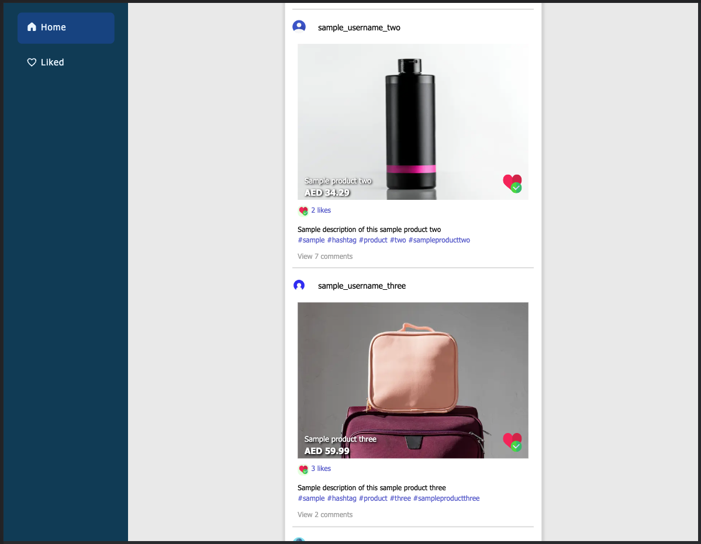

<h1>noon - Entry Coding Exercise</h1>

### noon Social Network Website (Web App)

## Table of Contents

[1. App Description](#1-app-description--)<br>
[2. System Architecture](#2-system-architecture--)<br>
[3. Consumed Technologies, Tools and Dependencies](#3-consumed-technologies-tools-and-dependencies--)<br>
[4. Installation (NextJS and Express apps)](#4-installation-nextjs-and-express-apps--)<br>
[5. Managing the Source Code](#5-managing-the-source-code--)<br>
[6. Usage](#6-usage--)<br>
[7. Application Designing - Low-fidelity Wireframes](#7-application-designing---low-fidelity-wireframes)<br>
[8. Git Commit Strategy](#8-git-commit-strategy--)<br>
[9. Credits](#9-credits--)<br>
[10. License](#10-license--)<br>

## Documentation

### 1. App Description -
This is a web application built on top of the Client/server architecture to deliver its end-user an interactive user experience. Allowing to view posts feed and like individual posts depending on their preference.<br/>
There are two web pages to this web application,
1. Landing page => Home => Shows the post feed and each post has a "Like" button
2. Liked page => Shows the posts that were liked by the current end-user and each post has a "Dislike" button

#### 1.1. App host configuration -
- Client-side application => <a href="https://noon-social-network.netlify.app">noon - Social Network</a> -> [](https://app.netlify.com/sites/noon-social-network/deploys) <br>
- Server-side application => <a href="https://noon-api-v1.onrender.com">noon api v1</a><br>
  - Eg: <a href="https://noon-api-v1.onrender.com/noon/api-v1/get-post-feed">get-post-feed endpoint</a> 

<hr>

### 2. System Architecture -
<p align="center">
  <kbd>
    
  </kbd>
</p>
<p align="center">Figure 2.1: System Architecture Diagram</p>

<hr>

### 3. Consumed Technologies, Tools and Dependencies -
* Programming Languages -
  * Client-side (Front end) - NextJS, Sass, TypeScript, TSX
  * Server-side (Back end) - NodeJS, Express, TypeScript
* Frameworks -
  * Facebook's [React](https://react.dev) using [React Hooks](https://react.dev/reference/react)
  * Vercel's [NextJS](https://nextjs.org)
  * [Express](https://expressjs.com)
  * [Sass](https://sass-lang.com/)
* Tools - [Visual Studio Code](https://code.visualstudio.com)
* Main Dependencies -
  * [Axios](https://github.com/axios/axios) - Library to fetch data from an API service.
  * [React-icons](https://react-icons.github.io/react-icons) - Icon library containing all icons from several third-party icon packs.

<hr>

### 4. Installation (NextJS and Express apps) -
In order to run the applications (NextJS and Express apps), their node modules are required.<br>
1. To download the associated node modules, go to the project file directory via the command prompt (CMD) and run the below command =>
```
npm install
```
2. After the node module installation, to run the web application, run the below command =>
```
npm start
```
For development purposes =>
```
npm run start:dev
```

<hr>

### 5. Managing the Source Code -
#### Client-side app (NextJS)
Client-side app's source code is located in =>
```
  noon-entry_coding_exercise -> Workspace -> noon-social_media_website -> client
```
Source code structure =>
<p align="center">
  <kbd>
      
  </kbd>
</p>
<p align="center">Figure 5.1: Client-side app (NextJS) Source Code Structure</p>

#### Server-side app (Express) (NodeJS)

Server-side app's source code is located in =>
```
  noon-entry_coding_exercise -> Workspace -> noon-social_media_website -> server
```
Source code component hierarchy =>
<p align="center">
  <kbd>
      
  </kbd>
</p>
<p align="center">Figure 5.2: Server-side app (Express) (NodeJS) Source Code Structure</p>

<hr>

### 6. Usage -
  #### 6.1. Functional features of the Web Application -
  * End-user can view a post feed with the following details,
    * Account details
    * Post details
    * Number of post likes
    * Post comments
  * End-user can like a post from the post feed
  * End-user can view the already liked posts on a separate web page
  * End-user can unlike an already liked post
  * End-user is able to view the web application in the mobile view and desktop view with the appropriate layout changes
  #### 6.2. Non-functional features of the Web Application -
  * Code Readability
  * Code Maintainability
  * Code Reusability
  * Code Scalability
  * Error handling
  #### 6.3. Screenshots of the noon Social Network Website (Web App) -
  ##### 6.3.1. Mobile view (414 x 896) (iPhone XR) =>
  #### 6.3.1.1. Landing (Home) page loading screen
<p align="center">
  <kbd>
      
  </kbd>
</p>
<p align="center">Figure 6.3.1.1.1: Mobile view - Landing (Home) page loading screen</p>

  #### 6.3.1.2. Landing (Home) page
<p align="center">
  <kbd>
      
  </kbd>
</p>
<p align="center">Figure 6.3.1.2.1: Mobile view - Landing (Home) page</p>

  #### 6.3.1.3. Liked page - No liked posts
<p align="center">
  <kbd>
      
  </kbd>
</p>
<p align="center">Figure 6.3.1.3.1: Mobile view - Landing (Home) page</p>

  #### 6.3.1.4. Landing (Home) page - With two liked posts
<p align="center">
  <kbd>
      
  </kbd>
</p>
<p align="center">Figure 6.3.1.4.1: Mobile view - Landing (Home) page - With two liked postse</p>

  #### 6.3.1.5. Liked page - With two liked posts
<p align="center">
  <kbd>
      
  </kbd>
</p>
<p align="center">Figure 6.3.1.5.1: Mobile view - Liked page - With two liked posts</p>

  #### 6.3.1.6. Landing (Home) page error screen
<p align="center">
  <kbd>
      
  </kbd>
</p>
<p align="center">Figure 6.3.1.6.1: Mobile view - Landing (Home) page error screen</p>

  #### 6.3.1.7. Liked page error screen
<p align="center">
  <kbd>
      
  </kbd>
</p>
<p align="center">Figure 6.3.1.7.1: Mobile view - Liked page error screen</p>

  ##### 6.3.2. Desktop view (1584 x 1228) =>
  #### 6.3.2.1. Landing (Home) page loading screen
<p align="center">
  <kbd>
      
  </kbd>
</p>
<p align="center">Figure 6.3.2.1.1: Desktop view - Liked page error screen</p>

  #### 6.3.2.2. Landing (Home) page
<p align="center">
  <kbd>
      
  </kbd>
</p>
<p align="center">Figure 6.3.2.2.1: Desktop view - Landing (Home) page</p>

  #### 6.3.2.3. Liked page - No liked posts
<p align="center">
  <kbd>
      
  </kbd>
</p>
<p align="center">Figure 6.3.2.3.1: Desktop view - Liked page - No liked posts</p>

  #### 6.3.2.4. Landing (Home) page - With two liked posts
<p align="center">
  <kbd>
      
  </kbd>
</p>
<p align="center">Figure 6.3.2.4.1: Desktop view - Landing (Home) page - With two liked posts</p>

  #### 6.3.2.5. Liked page - With two liked posts
<p align="center">
  <kbd>
      
  </kbd>
</p>
<p align="center">Figure 6.3.2.5.1: Desktop view - Liked page - With two liked posts</p>

  #### 6.3.2.6. Landing (Home) page error screen
<p align="center">
  <kbd>
      
  </kbd>
</p>
<p align="center">Figure 6.3.2.6.1: Desktop view - Landing (Home) page error screen</p>

  #### 6.3.2.7. Liked page error screen
<p align="center">
  <kbd>
      
  </kbd>
</p>
<p align="center">Figure 6.3.2.7.1: Desktop view - Liked page error screen</p>

<hr>

### 7. Application Designing - Low-fidelity Wireframes
  #### 7.1. Mobile view =>
<p align="center">
  <kbd>
      
  </kbd>
</p>
<p align="center">Figure 7.1.1: Application Mobile View Low-fidelity Wireframe</p>

  #### 7.2. Desktop view =>
<p align="center">
  <kbd>
      
  </kbd>
</p>
<p align="center">Figure 7.2.1: Application Desktop View Low-fidelity Wireframe</p>

<hr>

### 8. Git Commit Strategy -
This repository contains two branches, main and develop. In the duration of the development of the source code and documentation, change commits were pushed to the develop branch. <br/>
The contents of the develop branch were reviewed in groups and merged into the main branch. <br/>
As shown in the below table, commits were pushed incrementally, <br/>
| Version | Commit Group | Project Tasks |
|---------|--------------|---------------|
| v1 | Group 1 - Documentation | Design low-fidelity wireframes |
| v1 | Group 2 - Back-end | Setup NodeJS server application |
| v1 | Group 3 - Front-end | Setup NextJS client application |
<p align="center">Table 8.1: Git Commit Strategy 

<hr>

### 9. Credits -
This project to build a sample social network website was developed for the entry evaluation process at noon. The functional requirements were provided by noon.<br>
The project was developed using the best practices and guidance with the use of legitimate online documentation (docs) and YouTube videos.<br>
For learning purposes, other developers' source codes were reviewed on sample applications built and documented online.<br>
Documentation and source code in this repository was developed by H.V.L.Hasanka.

Extended credits => <a href="./Image-Credits.md">Image credits</a>

<hr>

### 10. License -
Copyright (c) 2023 H.V.L.Hasanka<br>
Licensed under MIT License
